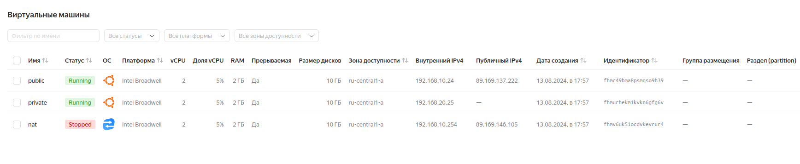

# «ОРГАНИЗАЦИЯ СЕТИ»

### Задание 1. Yandex Cloud

### Что нужно сделать

*Создать пустую VPC. Выбрать зону.*

*Публичная подсеть:*

*-Создать в VPC subnet с названием public, сетью 192.168.10.0/24.*

*-Создать в этой подсети NAT-инстанс, присвоив ему адрес 192.168.10.254. В качестве image_id использовать fd80mrhj8fl2oe87o4e1.*

*-Создать в этой публичной подсети виртуалку с публичным IP, подключиться к ней и убедиться, что есть доступ к интернету.*

*Приватная подсеть:*

*-Создать в VPC subnet с названием private, сетью 192.168.20.0/24.*

*-Создать route table. Добавить статический маршрут, направляющий весь исходящий трафик private сети в NAT-инстанс.*
- Создать в этой приватной подсети виртуалку с внутренним IP, подключиться к ней через виртуалку, созданную ранее, и убедиться, что есть доступ к интернету.*


Создаем пустую VPC с именем dvl:

```
resource "yandex_vpc_network" "dvl" {
  name = var.vpc_name

variable "vpc_name" {
  type        = string
  default     = "dvl"
  description = "VPC network"
}
```

Создаем в VPC публичную подсеть с названием public, сетью 192.168.10.0/24:

```
resource "yandex_vpc_subnet" "public" {
  name           = var.public_subnet
  zone           = var.default_zone
  network_id     = yandex_vpc_network.dvl.id
  v4_cidr_blocks = var.public_cidr
}

variable "public_cidr" {
  type        = list(string)
  default     = ["192.168.10.0/24"]
  description = "https://cloud.yandex.ru/docs/vpc/operations/subnet-create"
}

variable "public_subnet" {
  type        = string
  default     = "public"
  description = "subnet name"
}
```

Создаем в публичной подсети NAT-инстанс, присвоив ему адрес 192.168.10.254. В качестве image_id использую fd80mrhj8fl2oe87o4e1

Создаем в публичной подсети виртуальную машину с публичным IP.


Подключаемся к виртуальной машине и проверяем, есть ли из неё доступ к интернету:


Создаем в VPC приватную подсеть с названием private, сетью 192.168.20.0/24:

```
resource "yandex_vpc_subnet" "private" {
  name           = var.private_subnet
  zone           = var.default_zone
  network_id     = yandex_vpc_network.dvl.id
  v4_cidr_blocks = var.private_cidr
  route_table_id = yandex_vpc_route_table.private-route.id
}

variable "private_cidr" {
  type        = list(string)
  default     = ["192.168.20.0/24"]
  description = "https://cloud.yandex.ru/docs/vpc/operations/subnet-create"
}

variable "private_subnet" {
  type        = string
  default     = "private"
  description = "subnet name"
}
```

Создаем route table. Добавляем статический маршрут, направляющий весь исходящий трафик private сети в NAT-инстанс:

```
resource "yandex_vpc_route_table" "private-route" {
  name       = "private-route"
  network_id = yandex_vpc_network.dvl.id
  static_route {
    destination_prefix = "0.0.0.0/0"
    next_hop_address   = "192.168.10.254"
  }
}
```

Создаем в приватной подсети виртуальную машину с внутренним IP, внешний IP будет отсутствовать.

Для проверки доступности интернета на приватной виртуальной машине и работы NAT-инстанса скопируем свой приватный ssh ключ на публичную виртуальную машину. Далее с публичной виртуальной машины подключусь к приватной по внутреннему IP адресу:


Выключаем виртуальную машину с NAT-инстансом:





Проверяем работу интернета на приватной виртуальной машине:


Интернет на приватной виртуальной машине перестал работать после отключения NAT-инстанса,
следовательно статический маршрут, направляющий весь исходящий трафик private сети в NAT-инстанс был настроен корректно.

Output вывод Terraform выглядит следующим образом:


Ссылка на terraform-файлы:

https://github.com/dmistus/Net_1/tree/main/src


